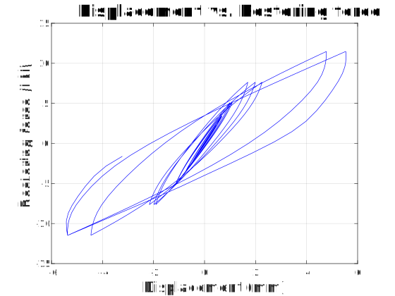

 # Simulation of a SDOF Bouc-Wen-Baber-Noori hysteretic system
 
 The code follows the formulae of the WIKIPEDIA page
 
 https://en.wikipedia.org/wiki/Bouc-Wen_model_of_hysteresis

The code outputs the following plots:

This is the pattern load shown in the standard ASTM-E2126:

The hysteresis plot:

